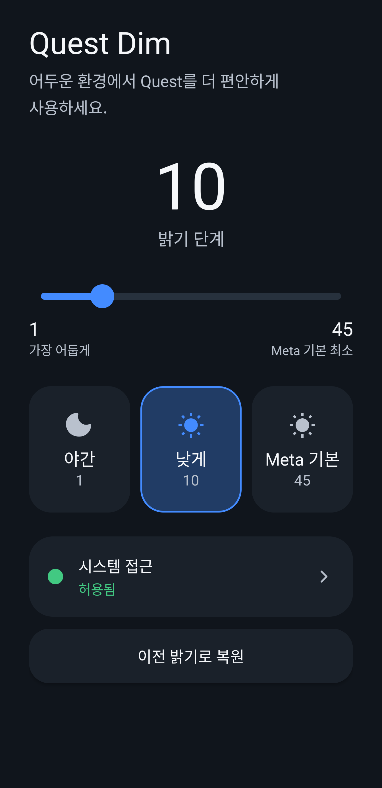
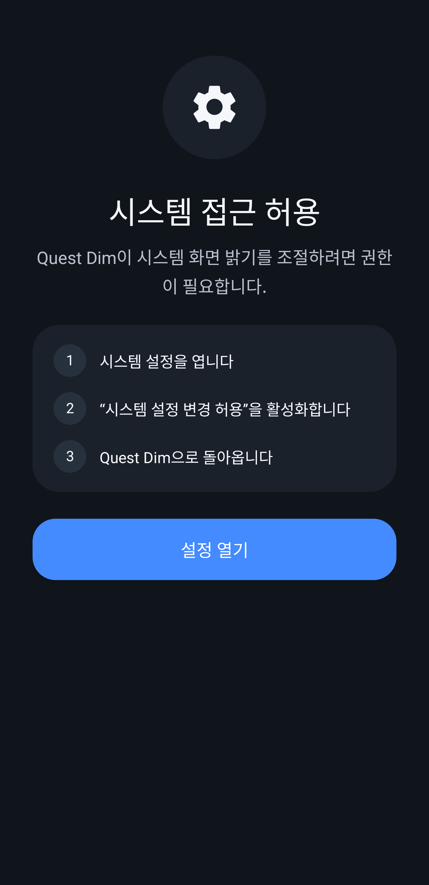

# Quest Dim

[English](README.md) | [한국어](README.ko.md)


Quest Dim은 Meta Quest용 가벼운 밝기 유틸리티입니다. Quest 기본 밝기
슬라이더에서 노출하지 않는 더 낮은 Android 시스템 화면 밝기를 선택할 수 있게 합니다.

> Quest Dim은 비공식 커뮤니티 유틸리티이며 Meta와 제휴, 보증 또는 후원 관계가 없습니다.

## 호환성 안내

Quest Dim은 **Meta Quest 3 실기에서 개발 및 테스트되었습니다.**

Meta Quest 2, Quest Pro, Quest 3S 등 다른 Meta Quest 기기와 기타 VR 헤드셋에서는
동일한 동작을 보장하지 않습니다. 기기, Horizon OS/Android 버전 및 시스템 밝기 구현
차이에 따라 일부 기능이 동작하지 않거나 예상과 다르게 동작할 수 있습니다.

현재 공식적으로 동작을 확인한 기기는 **Meta Quest 3**입니다.

## 스크린샷




## 주요 기능

- 밝기 단계 1–45
- Night(1), Dim(10), Meta(45) 프리셋
- 이전 밝기 및 밝기 모드 복원
- 28dp thumb과 8dp track을 쓰는 Quest 친화적 커스텀 슬라이더
- 영어와 한국어 UI
- 화면 오버레이, root, Shizuku, privileged ADB, 네트워크 연결, 계정, analytics 없음
- Meta Quest 3 실기 테스트 완료

## 설치

1. GitHub Releases에서 `QuestDim-v1.0.0.apk`를 받습니다.
2. Meta Quest에 APK를 sideload합니다.
3. **Quest Dim**을 실행합니다.
4. 안내에 따라 **시스템 설정 변경 허용** 권한을 승인합니다.
5. 원하는 밝기 단계를 선택합니다.

헤드셋이 연결되어 있다면 다음 명령으로 설치할 수 있습니다.

```bash
adb install -r QuestDim-v1.0.0.apk
```

## 권한 안내

Quest Dim은 로컬 시스템 화면 밝기를 변경하기 위해 Android의 **시스템 설정 변경**
권한만 요청합니다. 권한은 사용자가 Android/Horizon OS 설정 화면에서 직접 승인합니다.
앱은 백그라운드 우회, root, Shizuku, privileged ADB 연결을 사용하지 않습니다.

## 개인정보

Quest Dim은 개인정보를 수집·전송·공유하지 않습니다. 네트워크 권한, analytics,
tracking, 계정, 클라우드 서비스가 없습니다. 이전 밝기 값은 복원 기능에 필요한 동안에만
기기에 로컬로 저장됩니다. 자세한 내용은 [PRIVACY.md](PRIVACY.md)를 참고하세요.

## 소스에서 빌드

JDK 17 이상과 Android SDK Platform 36이 필요합니다. Android Studio에서 프로젝트를
열거나 다음을 실행하세요.

```bash
./gradlew assembleDebug
```

debug APK는 `app/build/outputs/apk/debug/app-debug.apk`에 생성됩니다. Release APK는
로컬에만 보관하는 keystore로 서명해야 하며, signing key와 password는 이 저장소에
포함하지 않습니다.

### Release 서명

로컬에서 release keystore를 생성하거나 선택한 뒤 `signing.properties.example`을
`signing.properties`로 복사하고 keystore 경로, alias, password를 입력하세요.
`signing.properties`와 keystore 파일은 Git에서 ignore됩니다. 이후
`./gradlew assembleRelease`를 실행하고, 서명된 결과를 GitHub Release용
`QuestDim-v1.0.0.apk`로 복사하면 됩니다.

## 라이선스

[MIT](LICENSE)
