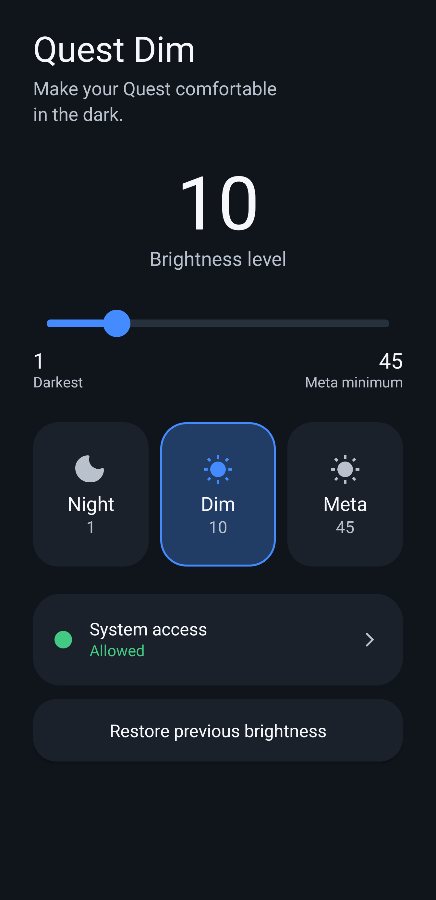
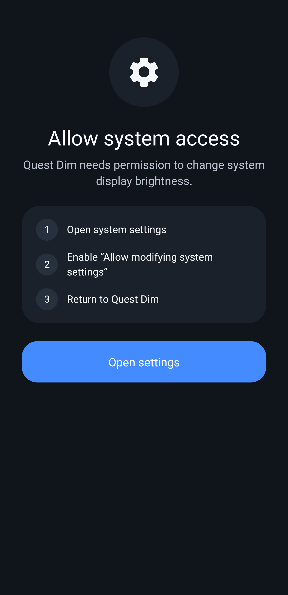

# Quest Dim

[English](README.md) | [한국어](README.ko.md)


A lightweight brightness utility for Meta Quest. Quest Dim lets you adjust the
Android system display brightness below the minimum exposed by the standard
Quest brightness slider.

> Quest Dim is an unofficial community utility. It is not affiliated with,
> endorsed by, or sponsored by Meta.

## Compatibility

Quest Dim is developed and tested on a **physical Meta Quest 3**.

Functionality is not guaranteed on other Meta Quest devices, including Quest 2,
Quest Pro, and Quest 3S, or on other VR headsets. Behavior may differ depending
on the device, Horizon OS/Android version, and the system brightness implementation.

The **Meta Quest 3** is currently the only device on which Quest Dim has been
officially tested.

## Screenshots




## Features

- Brightness levels from 1–45
- Night (1), Dim (10), and Meta (45) presets
- Restore the previous brightness and brightness mode
- Quest-friendly custom slider with a 28dp thumb and 8dp track
- English and Korean UI
- No screen overlay, root, Shizuku, privileged ADB, network connection, account, or analytics
- Tested on Meta Quest 3

## Installation

1. Download `QuestDim-v1.0.0.apk` from GitHub Releases.
2. Sideload it to your Meta Quest.
3. Open **Quest Dim**.
4. Allow **Modify system settings** when prompted.
5. Choose a brightness level.

For a connected headset, a release APK can be installed with:

```bash
adb install -r QuestDim-v1.0.0.apk
```

## Permission

Quest Dim requests Android's **Modify system settings** permission only to
change the local system display brightness. The permission is granted by the
user in the Android/Horizon OS settings page. The app does not use a background
workaround, root, Shizuku, or a privileged ADB connection.

## Privacy

Quest Dim does not collect, transmit, or store personal data. It has no network
permission, analytics, tracking, account, or cloud service. A previous
brightness value is stored locally only until it is restored. See
[PRIVACY.md](PRIVACY.md) for details.

## Build from source

The project requires JDK 17+ and an Android SDK with Platform 36 installed.
Open the project in Android Studio or run:

```bash
./gradlew assembleDebug
```

The debug APK is written to `app/build/outputs/apk/debug/app-debug.apk`.
Release artifacts must be signed with a locally held keystore; signing keys and
passwords are intentionally not part of this repository.

### Release signing

Create or select a release keystore locally, then copy
`signing.properties.example` to `signing.properties` and fill in the local
keystore path, alias, and passwords. `signing.properties` and keystore files
are ignored by Git. Run `./gradlew assembleRelease`; the signed output can then
be copied to `QuestDim-v1.0.0.apk` for a GitHub Release.

## License

[MIT](LICENSE)
